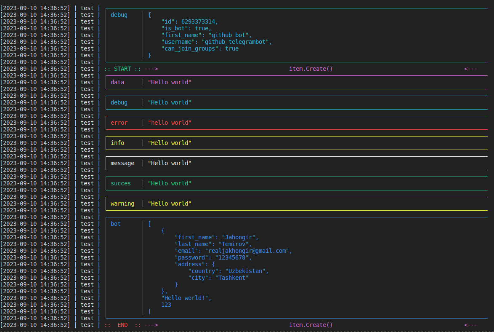

# Logt
Color logger for golang


# Usage


```go
func main() {
	// Create a new logger
	// Token: Telegram Bot token
    // UserID: Telegram User ID
	// Logo: Set to true if you want to show logo
    // NameSpace: Namespace of your project
    // If you want use Telegrambot set your token and user id, else set to empty
	l := NewLog(&Log{
		Token:     "6293373314:AAFVkfHFUowX1FpcRML5frzcAylXEeEMB9I",
		UserID:    265943548,
		Logo:      false,
		NameSpace: "test",
	})

	// Initialize writer logger
    // functionName: Function name
    // saveFile: If you set to true, the file will be saved, 
	w := l.NewWriter("item.Create()", true)
	defer w.Close()

	// Write a message
	w.Data("Hello world")
	w.Debug("Hello world")
	w.Error(errors.New("hello world"))
	w.Info("Hello world")
	w.Msg("Hello world")
	w.Succes("Hello world")
	w.Warning("Hello world")

	user := User{
		Firstname: "Jahongir",
		Lastname:  "Temirov",
		Email:     "realjakhongir@gmail.com",
		Password:  "12345678",
		Address: Address{
			Country: "Uzbekistan",
			City:    "Tashkent",
		},
	}

    // Use w.Send method to send message to telegram
	w.Send([]any{user, "Hello world!", 123})

}

type User struct {
	Firstname string  `json:"first_name"`
	Lastname  string  `json:"last_name"`
	Email     string  `json:"email"`
	Password  string  `json:"password"`
	Address   Address `json:"address"`
}

type Address struct {
	Country string `json:"country"`
	City    string `json:"city"`
}
```

# Output


# TODO

- Add writers with format
- Add writers to file
- ...